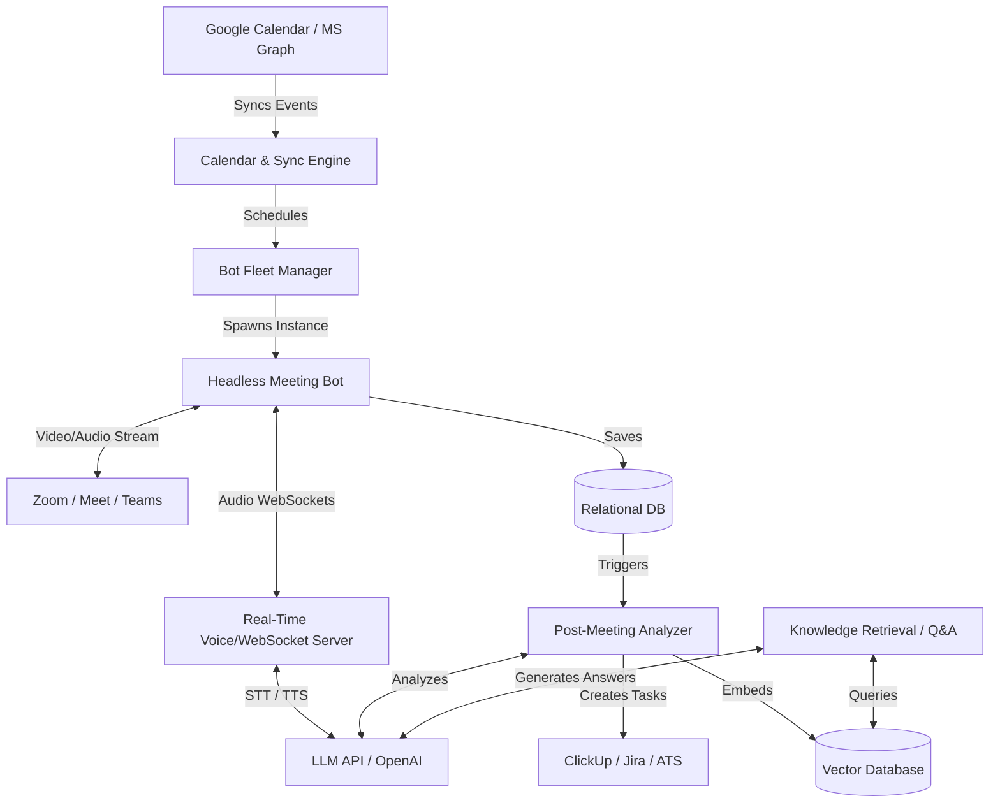

# Comprehensive Plan: Building an Autonomous AI Meeting Assistant

This document outlines the architecture, requirements, and step-by-step roadmap required to build an AI Meeting Bot from scratch. This system combines the active, live-joining capabilities of a "voice bot" with the asynchronous, analytical power of a "post-meeting processor".

## 1. High-Level Architecture Overview

To build this system, you need several distinct microservices working together.

## 2. Core Technical Requirements & Stack

If you are building this from scratch, here is what you will need:

### Infrastructure
*   **Database:** A relational database (PostgreSQL) for users, calendar events, transcripts, and bot status logs.
*   **Vector Database:** (e.g., Pinecone, Qdrant, or pgvector) to store transcript embeddings so users can "chat with their meetings" later.
*   **Job Queue:** (e.g., BullMQ, Redis) Critical for handling calendar polling and triggering heavy LLM post-processing tasks asynchronously.

### Third-Party APIs
*   **Calendar Integration:** Google Workspace API and Microsoft Graph API (OAuth2) to read user calendars.
*   **Meeting Bot Infrastructure:** 
    *   *Option A (Managed):* APIs like **Recall.ai** or **MeetingBaas**. They handle the nightmare of headless browsers and CAPTCHAs.
    *   *Option B (Self-Hosted):* A fleet of Dockerized headless browsers running Puppeteer/Playwright with virtual webcams and microphones (e.g., using GStreamer or ALSA). *Warning: Very difficult to maintain.*
*   **AI Models:**
    *   **STT (Speech-to-Text):** Deepgram or Whisper for high-speed, accurate transcription and speaker diarization (who said what).
    *   **LLM (Reasoning):** GPT-4o, Claude 3.5 Sonnet, or Gemini 1.5 Pro for extracting action items and answering questions.
    *   **TTS (Text-to-Speech):** ElevenLabs or OpenAI Realtime API if the bot needs to speak.
*   **Workflow Integrations:** APIs for ClickUp, Jira, Notion, or ATS platforms to dump the processed data.

---

## 3. Step-by-Step Implementation Roadmap

If you were to execute this build, here is the logical progression of phases:

### Phase 1: The Foundation (Calendars & Scheduling)
Before a bot can join a meeting, it needs to know the meeting exists.
1.  **OAuth Integration:** Build flows for users to connect their Google and Microsoft accounts.
2.  **Calendar Polling:** Create a cron job that runs every 5 minutes, scanning the connected calendars for events starting in the next ~30 minutes.
3.  **Meeting URL Extraction:** Write regex parsers to find Zoom, Google Meet, and Teams URLs in calendar descriptions and location fields.
4.  **Conflict Resolution:** Handle duplicate meetings, recurring events, and cancellations.

### Phase 2: The Observer (Silent Joining & Transcription)
Get the bot into the meeting to listen and record.
1.  **Bot Spawning:** Hook your calendar engine up to your Bot Infrastructure (e.g., Recall.ai). When a meeting is 5 minutes away, spawn a bot instance.
2.  **Waiting Room Handling:** The bot must know how to wait in the lobby until the host admits it.
3.  **Recording & Diarization:** Capture the audio stream. Pass the audio through an STT provider (Deepgram) to get a real-time transcript mapped to specific speakers (e.g., `Speaker 1: Hello`).
4.  **Webhook Listeners:** Build endpoints to receive alerts when the bot joins, gets kicked out, or when the final transcript is ready.

### Phase 3: Post-Meeting Intelligence (Analysis & Workflows)
Turn the raw text into actionable business value.
1.  **Prompt Engineering:** Design system prompts tailored to specific meeting types. 
    *   *Standups:* "Extract blockers and what each person did."
    *   *Interviews:* "Score this candidate on technical skills and culture fit based on the transcript."
    *   *General:* "Extract action items, assignees, and deadlines."
2.  **Keyword Routing:** Build a system that reads the meeting title (e.g., "Engineering Standup") and routes it to the correct LLM prompt.
3.  **Workflow Automation:** Take the JSON output from the LLM and push it to external tools. Create tasks in ClickUp, append summaries to Notion docs, or send a Slack message summarizing the call.

### Phase 4: Knowledge Base (Q&A feature)
Allow the user to ask questions about past meetings.
1.  **Data Chunking:** Split the completed transcripts into smaller, overlapping chunks.
2.  **Embedding:** Convert these text chunks into vector embeddings using an embedding model (like `text-embedding-3-small`).
3.  **Vector Storage:** Store these in a Vector Database tied to the user's ID.
4.  **RAG (Retrieval-Augmented Generation):** Build a chat interface. When a user asks "What did Sarah say about the marketing budget last week?", embed the query, search the Vector DB for the most relevant transcript chunks, pass them to an LLM, and generate the answer.

### Phase 5: The Interactive Participant (Real-time Voice)
Make the bot talk back.
1.  **WebSocket Audio Streaming:** Instead of just recording, the bot connects to a WebSocket server, streaming audio byte-chunks in real-time.
2.  **VAD (Voice Activity Detection):** The server must detect when humans stop speaking so the bot knows it's its turn to talk.
3.  **Real-time Processing Loop:** `Audio In -> STT -> LLM generates response -> TTS -> Audio Out`.
4.  **Virtual Devices:** Feed the generated TTS audio back into the headless browser's virtual microphone so the meeting participants can hear it.

---

## 4. Major Challenges to Anticipate

*   **Meeting Host Admission:** Bots usually get stuck in waiting rooms. If the host doesn't let them in, the system fails. You need robust error handling for this.
*   **Cost Management:** Running a 4-core headless browser (required for smooth audio) for 60 minutes, plus LLM costs, plus STT costs, adds up very quickly. Unit economics are critical.
*   **Platform UI Updates:** Zoom, Meet, and Teams frequently change their web UI. If you build your own headless browsers, your bot's CSS selectors for the "Join" or "Chat" buttons will break constantly. Using a managed service like Recall.ai mitigates this.
*   **Latency in Interactive Mode:** For the bot to feel natural, the time from a human stopping speaking to the bot replying must be under 800ms. Achieving this requires highly optimized streaming and edge deployments.
*   **Consent and Privacy:** Depending on jurisdiction, you may need to announce that the meeting is being recorded (e.g., via a chat message or an audio disclaimer when the bot joins).
